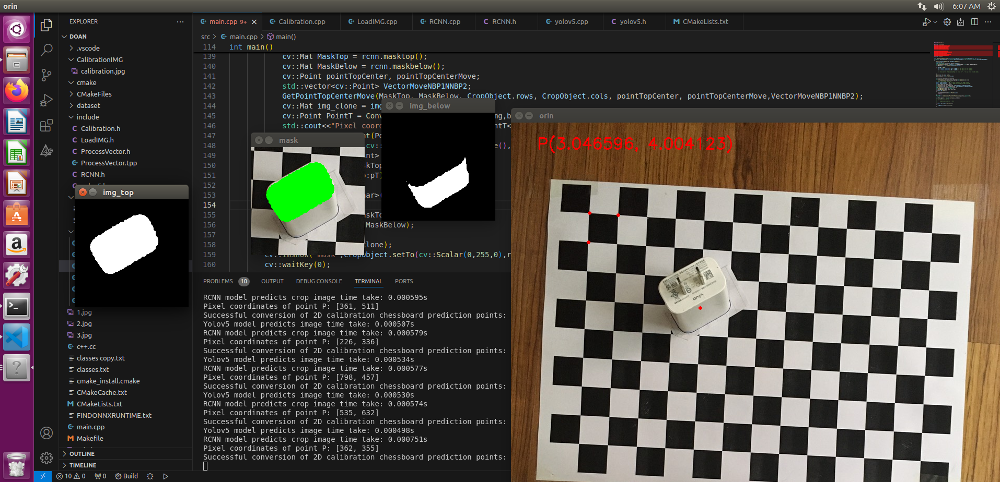

# M-Calib: A Monocular 3D Object Localization using 2D Estimates for Industrial Robot Vision System
Implementation code for our paper ["M-Calib: A Monocular 3D Object Localization using 2D Estimates for Industrial Robot Vision System"](https://assets.researchsquare.com/files/rs-4019542/v1_covered_5a75ac68-1bc8-4bdd-b2c5-8bbdb1eac8f1.pdf?c=1711473654)

Thanh Nguyen Canh, Du Trinh Ngoc, Xiem HoangVan, "**Monocular 3D Object Localization using 2D Estimates for Industrial Robot Vision System**," *Journal of Automation, Mobile Robotics and Intelligent Systems*, 2024. [[**Journal of Automation, Mobile Robotics and Intelligent Systems**](https://doi.org/)] [[Citation](#citation)]

## Citation
```
@article{canhmonocular2025,
  title = {Monocular 3D Object Localization using 2D Estimates for Industrial Robot Vision System},
  url = {https://www.jamris.org/index.php/JAMRIS/article/view/1485},
  DOI = {https://doi.org/10.14313/jamris-2025-025},
  journal = {Journal of Automation, Mobile Robotics and Intelligent Systems},
  publisher = {Industrial Research Institute for Automation and Measurements PIAP, Poland},
  author = {Thanh, Nguyen Canh and Du, Trinh Ngoc and Xiem HoangVan},
  year = {2025},
  month = sep,
  volume = {19},
  pages = {53--65}
}
```

## Our proposed:


## Table of Contents

- [Introduction](#introduction)
- [Installation](#installation)
- [Usage](#usage)
- [Demo](#demo)

## Introduction
Find the coordinates of the center point of the object on the bottom surface. Then convert to the chessboard coordinates corresponding to the reference point.


## Installation

This section installing ONNX Runtime version 1.12.1 and OpenCV version 4.10

## Usage

#### Download ONNX Models and Dataset

Download the ONNX models YOLOv5, RCNN into the `models` directory. And the image dataset from the following Google Drive into `dataset`.

**Google Drive Link**: [Download](https://drive.google.com/drive/folders/1y-XrTXRQywmW5O1Tz1JYiJnR0lOq0Iyn?hl=vi)

## Demo
The results obtained are demonstrated as shown in the image below.
<p align="center">
  
</p>
